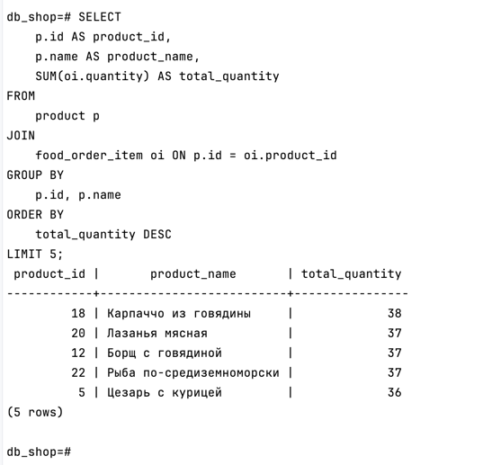
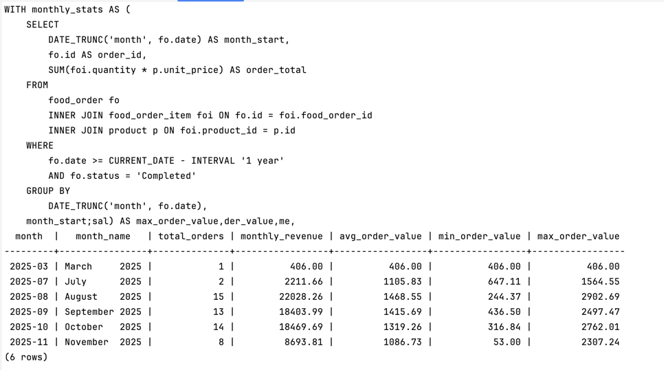
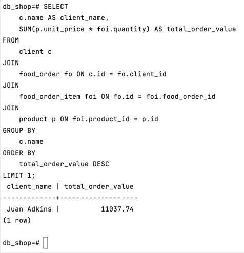
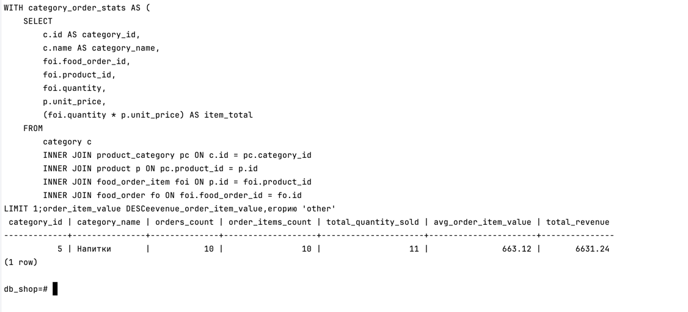
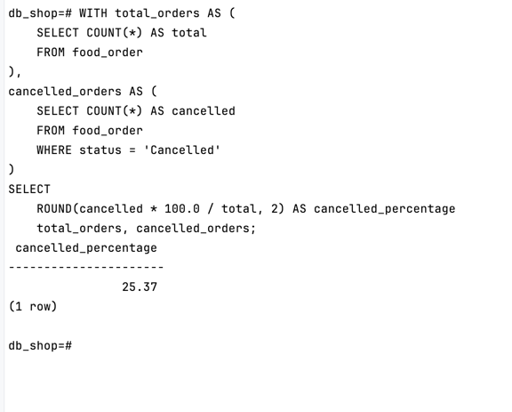
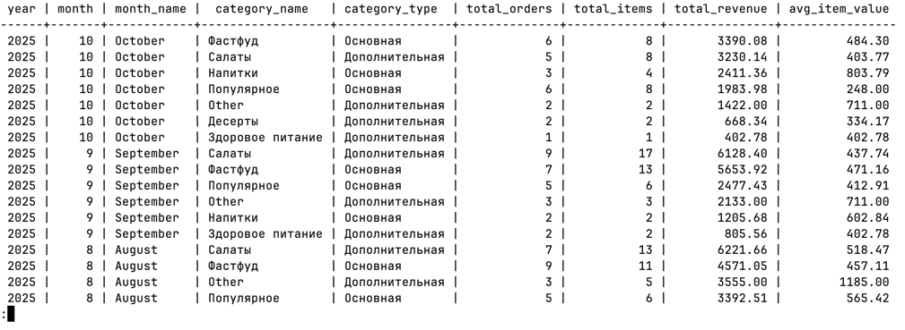
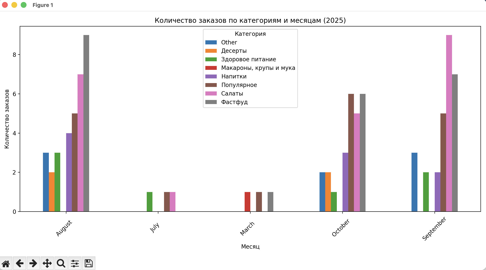
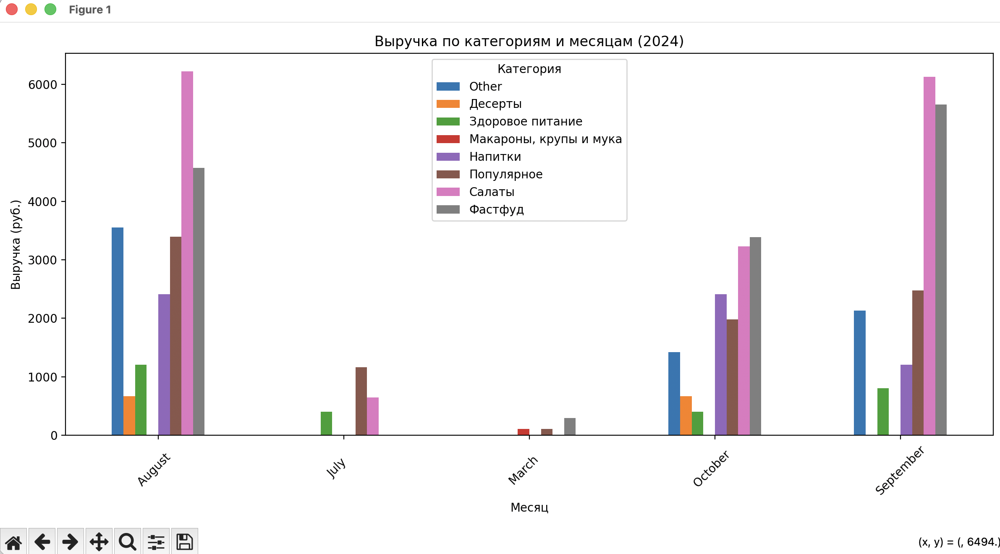

# Блок 1: Проектирование БД
## 1.1. Сущности и связи

### Сущность клиент
> Хранит информацию о клиентах. PK: ClientID.

client
- `id` (PRIMARY KEY) - INT, тк уникальный идентификатор, целое число.
- `name` - VARCHAR(100), тк 100 символов хватит для имени клиента
- `phone_number` - VARCHAR(20), тк 20 символов точно хватит для номера телефона
- `username` - VARCHAR(16), тк имя пользователя не должно быть длинным
- `password` - VARCHAR(128), тк 128 это длина SHA-512 в hex

---

### Сущность категории товаров
> Хранит информацию о категориях. PK: CategoryID.

category
- `id` (PRIMARY KEY) - INT, тк уникальный идентификатор, целое число.
- `name` - VARCHAR(100), тк 100 символов хватит для категории товара

---

### Сущность товар
> Хранит товары с категорией и ценой. PK: ProductID

product
- `id` (PRIMARY KEY) - INT, тк уникальный идентификатор, целое число.
- `name` - VARCHAR(100), тк 100 символов хватит для названия товара
- `description` - VARCHAR(255), тк описание не должно быть сильно большим
- `grams` - NUMERIC(6,2), тк нецелое число
- `calories` - NUMERIC(6,2), тк нецелое число
- `proteins` - NUMERIC(5,2), тк нецелое число
- `fats` - NUMERIC(5,2), тк нецелое число
- `carbs` - NUMERIC(5,2), тк нецелое число
- `ingredients` - TEXT, тк нельзя ограничить по длине
- `unit_price` - NUMERIC(10,2), тк цена с двумя знаками после запятой

---

### Товар - категория
> Хранит связь категории и товара. Много ко многим.

product_category
- `id`(PRIMARY KEY) - INT, тк уникальный идентификатор, целое число
- `product_id` - INT, тк внешний ключ на product(id)
- `category_id` - INT, тк внешний ключ на category(id)

---

### Сущность заказ
> Хранит заказы с датой и статусом. PK: OrderID. FK: Client_id → Clients

food_order
- `id` (PRIMARY KEY) - INT, тк уникальный идентификатор, целое число.
- `client_id` - INT, тк внешний ключ на client(id)
- `date` - DATETIME, так как дата и время заказа
- `status` - ENUM('Completed', 'Cancelled', 'Processing'), тк других значений быть не должно

### Сущность элементы заказа
> Разбивает заказы на товары (многие-ко-многим). PK: (OrderID, ProductID). FK: OrderID → Orders, ProductID → Products.

food_order_item
- `id` (PRIMARY KEY) - INT, тк уникальный идентификатор, целое число.
- `product_id` - INT, тк внешний ключ на product(id)
- `quantity` - INT, тк количество товаров
- `food_order_id` - INT, тк внешний ключ на food_order(id)


Также добавлю ограничения:

- `client.phoneNumber` - UNIQUE, NOT NULL - тк нужен для регистрации
- `client.username` - UNIQUE, NOT NULL - тк нужен для регистрации
- `client.password` - NOT NULL - тк нужен для регистрации
- `category.name` - UNIQUE, NOT NULL - тк не нужны две одинаковые или пустые категории товаров
- `product.unit_price` - NOT NULL - тк цена не может быть нулевой
- `product.name` - NOT NULL UNIQUE - тк в двух блюд с одинаковым названием не должно быть в одном месте
- `food_order.date` - TIMESTAMP NOT NULL DEFAULT CURRENT_TIMESTAMP - время заказа если не указано, то текущее
- `food_order` - UNIQUE (client_id, date) - тк два заказа не могут быть сделаны одним клиентов в одну и ту же секунду
- `food_order_item.quantity` - INT NOT NULL CHECK (quantity > 0) - тк количество должно быть больше нуля
- `food_order_item` - UNIQUE (order_id, product_id) - тк если несколько товаров, то нужно увеличивать кол-во

## 1.2. Скрипт инициализации
> Будем работать в PostgreSQL

Скрипт инициализации лежит в `init.sql`
```sql
-- Создание последовательностей
CREATE SEQUENCE IF NOT EXISTS client_id_seq START WITH 1;
CREATE SEQUENCE IF NOT EXISTS food_order_id_seq START WITH 1;
CREATE SEQUENCE IF NOT EXISTS category_id_seq START WITH 1;
CREATE SEQUENCE IF NOT EXISTS product_id_seq START WITH 1;
CREATE SEQUENCE IF NOT EXISTS food_order_item_id_seq START WITH 1;
CREATE SEQUENCE IF NOT EXISTS product_category_id_seq START WITH 1;

-- Создание типов
CREATE TYPE ENUM_STATUS AS ENUM ('Completed', 'Cancelled', 'Processing');

-- Создание таблицы клиентов
CREATE TABLE client (
    id INT PRIMARY KEY DEFAULT nextval('client_id_seq'),
    name VARCHAR(100),
    phone_number VARCHAR(20) NOT NULL UNIQUE,
    username VARCHAR(16) NOT NULL UNIQUE,
    password VARCHAR(128) NOT NULL
);

-- Создание таблицы категорий
CREATE TABLE category (
    id INT PRIMARY KEY DEFAULT nextval('category_id_seq'),
    name VARCHAR(100) NOT NULL UNIQUE
);

-- Создание таблицы товаров
CREATE TABLE product (
    id INT PRIMARY KEY DEFAULT nextval('product_id_seq'),
    name VARCHAR(100) NOT NULL UNIQUE,
    description VARCHAR(255),
    grams NUMERIC(6,2),
    calories NUMERIC(6,2),
    proteins NUMERIC(5,2),
    fats NUMERIC(5,2),
    carbs NUMERIC(5,2),
    ingredients TEXT,
    unit_price NUMERIC(10,2) NOT NULL
);

-- Создание таблицы связи товаров и категорий
CREATE TABLE product_category (
    id INT PRIMARY KEY DEFAULT nextval('product_category_id_seq'),
    product_id INT NOT NULL,
    category_id INT NOT NULL,
    FOREIGN KEY (product_id) REFERENCES product(id),
    FOREIGN KEY (category_id) REFERENCES category(id),
    UNIQUE (product_id, category_id)
);

-- Создание таблицы заказов
CREATE TABLE food_order (
    id INT PRIMARY KEY DEFAULT nextval('food_order_id_seq'),
    client_id INT NOT NULL,
    date TIMESTAMP NOT NULL DEFAULT CURRENT_TIMESTAMP,
    status ENUM_STATUS,
    FOREIGN KEY (client_id) REFERENCES client(id),
    UNIQUE (client_id, date)
);

-- Создание таблицы элементов заказа
CREATE TABLE food_order_item (
    id INT PRIMARY KEY DEFAULT nextval('food_order_item_id_seq'),
    food_order_id INT NOT NULL,
    product_id INT NOT NULL,
    quantity INT NOT NULL CHECK (quantity > 0),
    FOREIGN KEY (food_order_id) REFERENCES food_order(id),
    FOREIGN KEY (product_id) REFERENCES product(id),
    UNIQUE (food_order_id, product_id)
);
```

## 1.3. SQL-запросы
Для написания запросов необходимо поднять базу данных и заполнить ее значениями. Заполнение значениями будет описано в 
блоке 2, а инициализация БД здесь.

Поднятие базы данных лежит в `docker-compose.yml`
```bash
services:
  db:
    image: postgres
    container_name: db_shop_container
    ports:
      - "5435:5432"
    environment:
      POSTGRES_USER: user
      POSTGRES_PASSWORD: password
      POSTGRES_DB: db_shop
      PGDATA: /var/lib/postgresql/data/pgdata
    volumes:
      - ./postgres-data:/var/lib/postgresql/data
      - ./init.sql:/docker-entrypoint-initdb.d/init.sql
    restart: unless-stopped
```

```bash
docker exec -it db_shop_container /bin/bash
```
```bash
psql -U user -d db_shop
```

1) Вывести топ-5 самых продаваемых товаров по количеству за весь период.
```sql
SELECT 
    p.id AS product_id, 
    p.name AS product_name, 
    SUM(oi.quantity) AS total_quantity
FROM 
    product p
JOIN 
    food_order_item oi ON p.id = oi.product_id
GROUP BY 
    p.id, p.name
ORDER BY 
    total_quantity DESC
LIMIT 5; 
```

2) Рассчитать ежемесячную выручку магазина за последний год.
```sql
WITH monthly_stats AS (
    SELECT 
        DATE_TRUNC('month', fo.date) AS month_start,
        fo.id AS order_id,
        SUM(foi.quantity * p.unit_price) AS order_total
    FROM 
        food_order fo
        INNER JOIN food_order_item foi ON fo.id = foi.food_order_id
        INNER JOIN product p ON foi.product_id = p.id
    WHERE 
        fo.date >= CURRENT_DATE - INTERVAL '1 year'
        AND fo.status = 'Completed'
    GROUP BY 
        DATE_TRUNC('month', fo.date),
        fo.id
)
SELECT 
    TO_CHAR(month_start, 'YYYY-MM') AS month,
    TO_CHAR(month_start, 'Month YYYY') AS month_name,
    COUNT(order_id) AS total_orders,
    SUM(order_total) AS monthly_revenue,
    ROUND(AVG(order_total), 2) AS avg_order_value,
    MIN(order_total) AS min_order_value,
    MAX(order_total) AS max_order_value
FROM 
    monthly_stats
GROUP BY 
    month_start
ORDER BY 
    month_start;
```

3) Найти клиента, сделавшего самый дорогой заказ за всё время.
```sql
SELECT
    c.name AS client_name,
    SUM(p.unit_price * foi.quantity) AS total_order_value
FROM
    client c
JOIN
    food_order fo ON c.id = fo.client_id
JOIN
    food_order_item foi ON fo.id = foi.food_order_id
JOIN
    product p ON foi.product_id = p.id
GROUP BY
    c.name
ORDER BY
    total_order_value DESC
LIMIT 1;
```

4) Определить категорию товаров с самой высокой средней ценой заказа.
```sql
WITH category_order_stats AS (
    SELECT 
        c.id AS category_id,
        c.name AS category_name,
        foi.food_order_id,
        foi.product_id,
        foi.quantity,
        p.unit_price,
        (foi.quantity * p.unit_price) AS item_total
    FROM 
        category c
        INNER JOIN product_category pc ON c.id = pc.category_id
        INNER JOIN product p ON pc.product_id = p.id
        INNER JOIN food_order_item foi ON p.id = foi.product_id
        INNER JOIN food_order fo ON foi.food_order_id = fo.id
    WHERE 
        fo.status = 'Completed'  -- Только завершенные заказы
        AND LOWER(c.name) != 'other'  -- Исключаем категорию 'other'
)
SELECT 
    category_id,
    category_name,
    COUNT(DISTINCT food_order_id) AS orders_count,
    COUNT(*) AS order_items_count,
    SUM(quantity) AS total_quantity_sold,
    ROUND(AVG(item_total), 2) AS avg_order_item_value,
    SUM(item_total) AS total_revenue
FROM 
    category_order_stats
GROUP BY 
    category_id, category_name
ORDER BY 
    avg_order_item_value DESC
LIMIT 1;
```

5) Посчитать процент отмененных заказов (Status = 'Cancelled') от общего числа.
```sql
WITH total_orders AS (
    SELECT COUNT(*) AS total 
    FROM food_order
),
cancelled_orders AS (
    SELECT COUNT(*) AS cancelled 
    FROM food_order 
    WHERE status = 'Cancelled'
)
SELECT 
    ROUND(cancelled * 100.0 / total, 2) AS cancelled_percentage
FROM 
    total_orders, cancelled_orders;
```

# Блок 2: Загрузка данных в БД
## 2.1. Генерация исходных данных
- `clients.csv`: clientName, phoneNumber, username, password
```bash
Иванова Лариса Никитична | +7(982)980-81-30 | ivanovalar | e90901a8e9ab0aaad99cbf489540e331dcfe97e6f9fd7d4679270d4681d659f44cca2aae1e796c3704b29680cf73e841db73aac51d845766d66f1b35975a5369
Anna Emily Smith | +44 20 7123 4567 | emilysmith | 740f622cf44efddb688b0936e7eca686be6e4d73e1ce2ca00fc8e48130bf1d825159c26e728b942795d59ac5f445005cd155175f559f132f40ed6e5ff20a51cc
```

- `product.csv`: productName, productDescription, grams, calories, proteins, fats, carbs, ingredients, unit_price, categoryName
```bash
Чизбургер с говяжьей котлетой и плавленым сыром «Грабли» | Классический бургер с говяжьей котлетой, ломтиком сыра чеддер и маринованными огурцами в мягкой булочке с кунжутом. В составе есть лук и фирменный соус на основе майонеза и горчицы. | 125 | 264 | 9.4 | 14.3 | 24.3 | - | 299 |Фастфуд
Макароны с сырным соусом Mac&Cheese Карбонара с беконом | Макароны с сырным соусом и беконом быстро готовятся с молоком и сливочным маслом. Их можно разделить на две порции или съесть за раз | 143 | 12.4 | 4.7 | 64.8 | Макаронные изделия (группа А высший сорт): мука из твёрдой пшеницы (дурум) для макаронных изделий высшего сорта, вода питьевая. Соус «Сырный Карбонара с беконом» быстрого приготовления: сырный продукт сухой (сыр с м. д. жиры в сухом веществе 50%, мальтодекстрин, эмульгирующая соль (Е339Н), соль, бекон сушёный, гидролизат соевого белка, натуральные ароматизаторы, перец черный, белый. | 107 | Макароны, крупы и мука; Популярное  
```

- `orders.csv`: clientName, orderDate, status, totalAmount, products
```bash
Иванова Лариса | 2025-03-15 | Completed | 406 | Чизбургер с говяжьей котлетой и плавленым сыром «Грабли»; Макароны с сырным соусом Mac&Cheese Карбонара с беконом 
Anna Emily Smith | 2025-03-16 | | 107 | Макароны с сырным соусом Mac&Cheese Карбонара с беконом 
```

## 2.2. Нормализация данных
- Очистка данных от дубликатов
```python3
before_products = len(products_df)
before_clients = len(clients_df)

products_df = products_df.drop_duplicates(subset=['productName'], keep='first')
clients_df = clients_df.drop_duplicates(subset=['username'], keep='first')

print(f"Products: {before_products} → {len(products_df)} (удалено {before_products - len(products_df)})")
print(f"Clients: {before_clients} → {len(clients_df)} (удалено {before_clients - len(clients_df)})") 
```
- Обработка пропусков в поле Category (заменить на значение 'Other').
```python3
category_str = (
    row["categoryName"].strip()
    if pd.notna(row["categoryName"])
    else "Other"
)
```
- Преобразование поля Price к числовому типу, удалив нечисловые символы.
```python3
def clean_numeric_field(value):
    if pd.isna(value):
        return None
    cleaned = re.sub(r"[^\d.,]", "", str(value))
    cleaned = cleaned.replace(",", ".")
    try:
        return float(cleaned) if cleaned else None
    except:
        return None
```
- Проверка поля Status на допустимость значений (только 'Completed', 'Cancelled', 'Processing'). Недопустимые значения 
заменить на 'Processing'.
```python3
def validate_status(status):
    valid_statuses = ["Completed", "Cancelled", "Processing"]
    if pd.isna(status) or status not in valid_statuses:
        return "Processing"
    return status
```

## 2.3. Вывод
Объясните, какие аномалии устраняет проведенная вами очистка данных.
- Проведенная нормализация данных (очистка от дубликатов, обработка пропусков, преобразование типов и валидация 
значений) устраняет несколько типов аномалий, которые могут привести к ошибкам в базе данных, искажению аналитики и 
нарушению целостности.

1) Очистка данных от дубликатов (`по productName` для продуктов и `username` для клиентов):
- Аномалии: Дубликаты записей. Это нарушает `UNIQUE-cоnstraints` в БД, приводит к ошибкам вставки и дублированию данных в 
отчетах.
- Обеспечивает уникальность ключевых полей, улучшает производительность запросов и точность агрегаций (например, в топ-5 
товаров).

2) Обработка пропусков в поле `Category` (замена на '`Other`'):
- Аномалии: `NULL`-значения в `category_name` (например, продукт без категории). Это может вызвать ошибки в FK-связях 
(если категория обязательна) или исказить группировку в отчетах (продукты без категории не попадут в анализ по 
категориям).
- Проверка `pd.notna(row["categoryName"])` и замена на "Other" (с `strip()` для удаления пробелов). 
- Заполняет пробелы, обеспечивая полноту данных. В хранилище данных (блок 3) это предотвращает `NULL` в измерениях, 
улучшая витрины (например, все продукты имеют категорию для группировки).

3) Преобразование поля `Price` к числовому типу (очистка от нечисловых символов):
- Аномалии: Строковые значения с символами (например, "299 руб." или "107,50" с запятой). Это приводит к ошибкам типов 
при вставке в `NUMERIC`-поле и невозможности математических операций (суммы, средние).
- Функция `clean_numeric_field` использует `regex re.sub(r"[^\d.,]", "", str(value))` для удаления всего, кроме цифр, точек 
и запятых, затем заменяет "," на "." и конвертирует в float. В примере, "299 руб." станет 299.0.
- Обеспечивает корректные числовые данные для расчетов (например, выручка в запросах 2 и 4). Предотвращает исключения в
Python и SQL.

4) Проверка поля `Status` на допустимость значений (только 'Completed', 'Cancelled', 'Processing'):
- Аномалии: Недопустимые или `NULL`-значения. Это нарушает `ENUM`-конstraint в БД и искажает аналитику (например, процент 
отмененных заказов будет неверным).
- Функция `validate_status` проверяет на список допустимых значений и заменяет недопустимые/`NULL` на "Processing". 
- Гарантирует консистентность данных, предотвращает ошибки вставки и обеспечивает точные фильтры в запросах (например, 
только 'Completed' для выручки).

Общий эффект нормализации:

- Целостность БД: Предотвращает нарушения constraints (`UNIQUE`, `NOT NULL`, `CHECK`)
- Качество аналитики: Устраняет шум (дубликаты, `NULL`), делая отчеты (топ-товары, выручка) точными.
- Надежность: Снижает риски ошибок при загрузке (например, через pandas и SQLAlchemy)


# Блок 3: Проектирование хранилища и визуализация
Задание:

1) Спроектируйте упрощенную схему хранилища данных (Data Warehouse) по принципу «звезда» для анализа продаж. Опишите 
таблицу фактов и таблицы измерений.

### Создание таблиц измерений

```sql
-- 1. Создание измерения даты
CREATE TABLE dim_date (
    date_id SERIAL PRIMARY KEY,
    full_date DATE NOT NULL UNIQUE,
    year INT,
    quarter INT,
    month INT,
    month_name VARCHAR(20),
    week INT,
    day_of_week INT,
    day_name VARCHAR(20),
    is_weekend BOOLEAN
);

-- 2. Создание измерения продуктов
CREATE TABLE dim_product (
    product_id INT PRIMARY KEY,
    product_name VARCHAR(100),
    description VARCHAR(255),
    grams NUMERIC(6,2),
    calories NUMERIC(6,2),
    proteins NUMERIC(5,2),
    fats NUMERIC(5,2),
    carbs NUMERIC(5,2)
);

-- 3. Создание измерения категорий
CREATE TABLE dim_category (
    category_id INT PRIMARY KEY,
    category_name VARCHAR(100),
    category_type VARCHAR(50)
);

-- 4. Создание измерения клиентов
CREATE TABLE dim_client (
    client_id INT PRIMARY KEY,
    client_name VARCHAR(100),
    username VARCHAR(16),
    phone_number VARCHAR(20),
    registration_date DATE
);
```
### Создание таблицы фактов
```sql
CREATE TABLE fact_sales (
    sale_id SERIAL PRIMARY KEY,
    date_id INT NOT NULL,
    product_id INT NOT NULL,
    category_id INT NOT NULL,
    client_id INT NOT NULL,
    order_id INT NOT NULL,
    quantity INT NOT NULL,
    unit_price NUMERIC(10,2) NOT NULL,
    total_amount NUMERIC(10,2) NOT NULL,
    order_status VARCHAR(20),
    FOREIGN KEY (date_id) REFERENCES dim_date(date_id),
    FOREIGN KEY (product_id) REFERENCES dim_product(product_id),
    FOREIGN KEY (category_id) REFERENCES dim_category(category_id),
    FOREIGN KEY (client_id) REFERENCES dim_client(client_id)
);
```
### Заполнение таблиц измерений данными

```sql
-- Заполнение dim_date (генерируем даты за последние 2 года)
INSERT INTO dim_date (full_date, year, quarter, month, month_name, week, day_of_week, day_name, is_weekend)
SELECT 
    date::date AS full_date,
    EXTRACT(YEAR FROM date) AS year,
    EXTRACT(QUARTER FROM date) AS quarter,
    EXTRACT(MONTH FROM date) AS month,
    TO_CHAR(date, 'Month') AS month_name,
    EXTRACT(WEEK FROM date) AS week,
    EXTRACT(DOW FROM date) AS day_of_week,
    TO_CHAR(date, 'Day') AS day_name,
    EXTRACT(DOW FROM date) IN (0, 6) AS is_weekend
FROM generate_series(
    CURRENT_DATE - INTERVAL '2 years',
    CURRENT_DATE,
    '1 day'::interval
) AS date
ON CONFLICT (full_date) DO NOTHING;

-- Заполнение dim_product из существующих данных
INSERT INTO dim_product (product_id, product_name, description, grams, calories, proteins, fats, carbs)
SELECT 
    id,
    name,
    description,
    grams,
    calories,
    proteins,
    fats,
    carbs
FROM product
ON CONFLICT (product_id) DO NOTHING;

-- Заполнение dim_category из существующих данных
INSERT INTO dim_category (category_id, category_name, category_type)
SELECT 
    id,
    name,
    CASE 
        WHEN LOWER(name) IN ('популярное', 'фастфуд', 'напитки') THEN 'Основная'
        ELSE 'Дополнительная'
    END AS category_type
FROM category
ON CONFLICT (category_id) DO NOTHING;

-- Заполнение dim_client из существующих данных
INSERT INTO dim_client (client_id, client_name, username, phone_number, registration_date)
SELECT 
    id,
    name,
    username,
    phone_number,
    CURRENT_DATE - INTERVAL '1 year' * RANDOM() AS registration_date -- примерная дата регистрации
FROM client
ON CONFLICT (client_id) DO NOTHING;
```
### Заполнение таблицы фактов

```sql
INSERT INTO fact_sales (
    date_id, 
    product_id, 
    category_id, 
    client_id, 
    order_id, 
    quantity, 
    unit_price, 
    total_amount, 
    order_status
)
SELECT 
    dd.date_id,
    p.id AS product_id,
    pc.category_id,
    fo.client_id,
    fo.id AS order_id,
    foi.quantity,
    p.unit_price,
    (foi.quantity * p.unit_price) AS total_amount,
    fo.status::VARCHAR
FROM 
    food_order fo
    JOIN food_order_item foi ON fo.id = foi.food_order_id
    JOIN product p ON foi.product_id = p.id
    JOIN product_category pc ON p.id = pc.product_id
    JOIN dim_date dd ON dd.full_date = DATE(fo.date)
WHERE 
    EXISTS (SELECT 1 FROM dim_product WHERE product_id = p.id)
    AND EXISTS (SELECT 1 FROM dim_category WHERE category_id = pc.category_id)
    AND EXISTS (SELECT 1 FROM dim_client WHERE client_id = fo.client_id);
```

2) Напишите SQL-запрос, который подготавливает витрину данных для построения дашборда: «Выручка и количество заказов по 
категориям товаров и месяцам».
```sql
CREATE VIEW mart_category_monthly_sales AS
SELECT 
    dd.year,
    dd.month,
    dd.month_name,
    dc.category_name,
    dc.category_type,
    COUNT(DISTINCT fs.order_id) AS total_orders,
    SUM(fs.quantity) AS total_items,
    ROUND(SUM(fs.total_amount), 2) AS total_revenue,
    ROUND(AVG(fs.total_amount), 2) AS avg_item_value
FROM 
    fact_sales fs
    JOIN dim_date dd ON fs.date_id = dd.date_id
    JOIN dim_category dc ON fs.category_id = dc.category_id
WHERE 
    fs.order_status = 'Completed'
GROUP BY 
    dd.year,
    dd.month,
    dd.month_name,
    dc.category_name,
    dc.category_type
ORDER BY 
    dd.year DESC,
    dd.month DESC,
    total_revenue DESC;
```

3) Постройте эту визуализацию (график или диаграмму) с помощью любого инструмента (Excel, Google Data Studio, Power BI,
Python matplotlib) и сделайте краткий вывод по результатам.

Кол-во заказов 
- В сентябре самые популярные категории: Салаты, Фастфуд, Популярное. Десерты и Макароны никто не заказывал.
- В октябре по полулярности категории те же. В этом месяце заказывали все, кроме Макарон
- В марте и июле меньше всего заказов
- В августе было сделано очень много заказов фастфуда
- Макароны заказывали только в марте

- Выручка выше всего по салатам в августе, затем в июле больше 6000
- Выручка по фастфуду меньше, чем по салатам, максимальное значение меньше 6000
